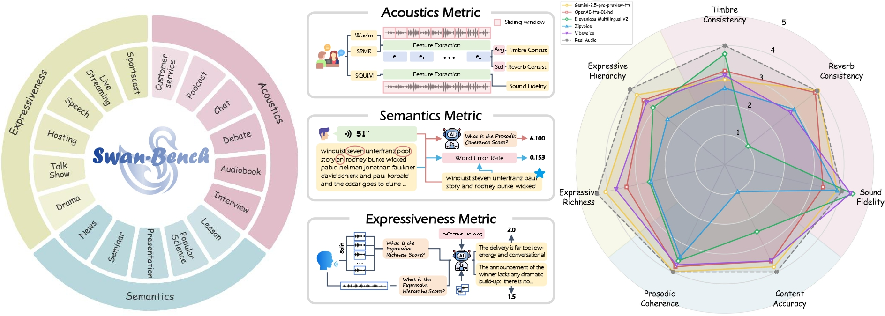
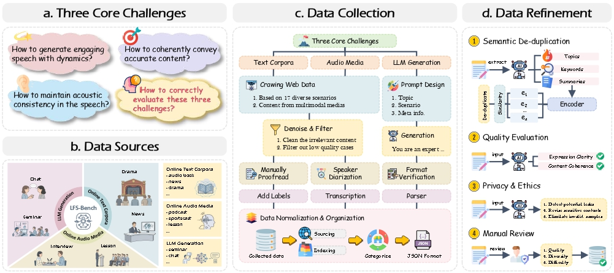
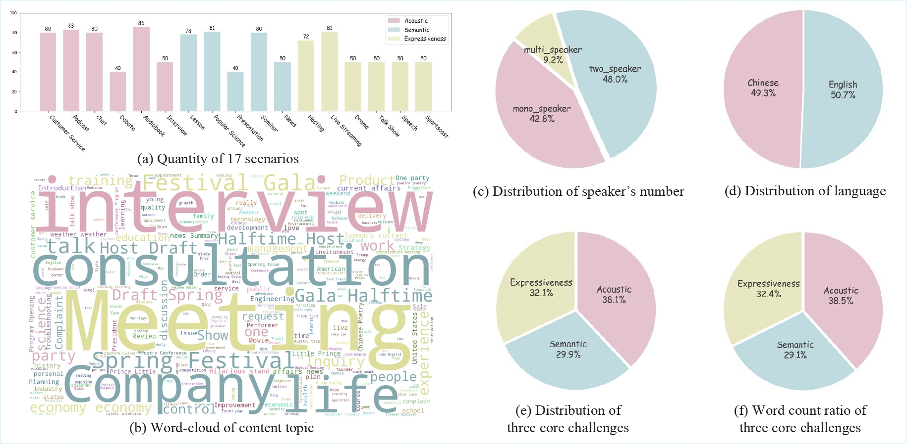

<div align="center">

# SwanBench-Speech: Comprehensive Benchmarking of Long-Form Speech Generation in Diverse Scenarios
#### Changhao Pan*, Rui Yang*, Han Wang*, Zhuan Zhou, Xuming He, Wenxiang Guo, Ziyue Jiang, Ruiqi Li, Yu Zhang, Chenyuhao Wen, Ke Lei, Xiang Yin, Jingyu Lu, Zhiyuan Zhu, Zhou Zhao | Zhejiang University

Test dataset and evaluation code of SwanBench-Speech (ACL 2026 Findings): Comprehensive Benchmarking of Long-Form Speech Generation in Diverse Scenarios

[](https://github.com/MM-Speech/SwanBench-Speech#)
[](https://david-pigeon.github.io/SwanBench-Speech_Demo/)
[](https://huggingface.co/datasets)
[](https://github.com/MM-Speech/SwanBench-Speech)

</div>

<p align="center">
  
</p>

## Overview

- Long-form speech generation has advanced rapidly in fidelity, but most public evaluations still focus on short utterances or narrowly defined tasks, leaving realistic long-context assessment underexplored.
- SwanBench-Speech is built for both long-form speech generation and dialogue generation, targeting scenarios that require stable speaker identity, semantic continuity, and expressive control across extended passages.
- The benchmark covers 17 common downstream scenarios and organizes them under three challenge axes: acoustics, semantics, and expressiveness, enabling structured analysis beyond a single overall score.
- SwanBench-Speech introduces an automated evaluation protocol with seven disentangled metrics and validates them with human alignment studies; extensive experiments show that current models still fall short on consistency, coherence, and expressive richness compared with real recordings.

## TODO List

- [x] Release the Full inference dataset
- [ ] Release the evaluation code
- [ ] Release the data processing pipeline 

## Key Features

- Scenario-rich benchmarking for long-form speech, spanning narration, presentation, news, chat, seminar, drama, customer service, sportscast, and other realistic applications.
- Disentangled evaluation along acoustics, semantics, and expressiveness, which makes model strengths and failure modes easier to interpret than a single aggregate metric.
- Bilingual benchmark coverage in Chinese and English, supporting cross-lingual comparison in long-form generation settings.
- Released inference text data for single-speaker, two-speaker, and multi-speaker setups, matching common deployment patterns for monologue and dialogue synthesis.
- Practical empirical insights for future model development, especially around consistency, prosodic coherence, and expressive control in long-context generation.


## Dataset

SwanBench-Speech releases the inference-side test set under `test_dataset/`, designed for benchmarking long-form speech generation across monologue and dialogue settings. The current release focuses on text prompts and dialogue scripts, while `test_dataset/timbre_reference/` is reserved for future reference-audio assets used in timbre-conditioned evaluation.

<p align="center">
  
</p>

### Directory Layout

```text
test_dataset/
├── text_data/
│   ├── mono_speaker.jsonl
│   ├── two_speaker.jsonl
│   └── multi_speaker.jsonl
└── timbre_reference/
    └── .gitkeep
```

### Released Splits

The released text-side benchmark contains 1,059 JSONL entries across 17 scenarios in Chinese and English.

| File | Samples | Speaker Setting | Languages | Representative Scenarios |
| --- | ---: | --- | --- | --- |
| `mono_speaker.jsonl` | 431 | Single-speaker long-form generation | Chinese, English | `lesson`, `speech`, `audiobook`, `news`, `popular_science`, `talk_show` |
| `two_speaker.jsonl` | 527 | Two-speaker dialogue generation | Chinese, English | `chat`, `customer_service`, `podcast`, `interview`, `drama`, `sportscast` |
| `multi_speaker.jsonl` | 101 | Multi-speaker dialogue generation | Chinese, English | `seminar`, `audiobook`, `hosting`, `podcast` |

<p align="center">
  
</p>

All three JSONL files share a lightweight record schema:

- `content`: a list of utterances, where each item contains `speaker` and `text`
- `theme`: the high-level topic, script theme, or prompt description
- `scene`: the target scenario label
- `language`: the language tag of the sample (`chinese` or `english`)
- `source`: the source link or data note when available
- `num_speakers`: the declared speaker count when provided in the release file

### Example Items

```json
{"scene":"talk_show","language":"english","num_speakers":1,"content":[{"speaker":"Speaker1","text":"Yeah, I've been living in America for a while now. It has been great. There's so much stuff here..."}]}
{"scene":"drama","language":"english","num_speakers":2,"content":[{"speaker":"Speaker1","text":"Well! Here we are."},{"speaker":"Speaker2","text":"Here we are. Aren't we?"}]}
{"scene":"audiobook","language":"english","num_speakers":3,"content":[{"speaker":"Speaker1","text":"The memory was formed when Tara was five, from a story her father told in vivid detail..."},{"speaker":"Speaker2","text":"Butter and honey shall he eat, that he may know to refuse the evil, and choose the good."}]}
```

These samples cover single-speaker narration, two-party conversation, and multi-party long-form interaction, providing a unified input format for model inference and downstream evaluation.

## Citation

If you find this code useful in your research, please cite our work.

```bibtex
@inproceedings{pan2026longformspeech,
  title = {Comprehensive Benchmarking of Long-Form Speech Generation in Diverse Scenarios},
  author = {Pan, Changhao and Yang, Rui and Wang, Han and Zhou, Zhuan and He, Xuming and Guo, Wenxiang and Jiang, Ziyue and Li, Ruiqi and Zhang, Yu and Wen, Chenyuhao and Lei, Ke and Yin, Xiang and Lu, Jingyu and Zhu, Zhiyuan and Zhao, Zhou},
  booktitle = {Findings of the Association for Computational Linguistics: ACL 2026},
  year = {2026},
  url = {https://github.com/MM-Speech/SwanBench-Speech}
}
```
